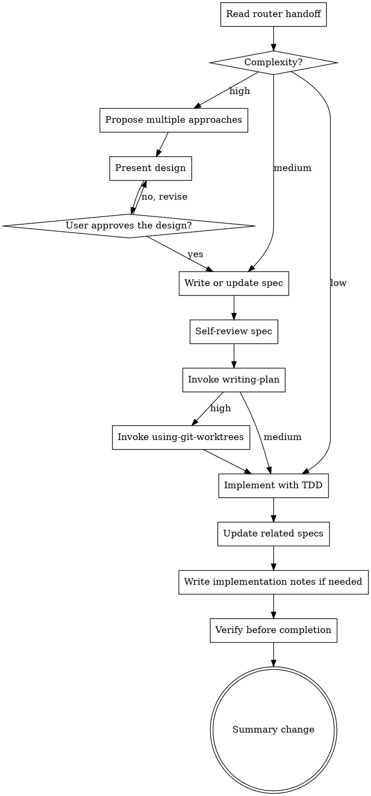

# Implementation

Carry an implementation task from the router's complexity classification through the required design, specification, planning, implementation, verification, and change summary.

`implementation` owns the execution workflow after `skill-router` selects Implementation Feature. It does not repeat task analysis or silently change the router's classification.

<HARD-GATE>
Use the Complexity already established by `skill-router`. Do not silently reclassify the task, skip a required approval, or begin implementation before the selected complexity path reaches Implement.
</HARD-GATE>

Anti-Pattern: Treating Every Implementation The Same

Do not force low-complexity work through unnecessary design documents. Do not send high-complexity work directly to code.

The amount of structure must match the router's classification:

- Low proceeds directly to implementation.
- Medium requires a spec and implementation plan.
- High requires approach comparison, design approval, a spec, an implementation plan, and an isolated worktree.

## Overview

The implementation workflow follows this sequence:

1. Read the router handoff.
2. Follow exactly one complexity path.
3. Implement with TDD.
4. Update related specs.
5. Record genuine unresolved uncertainty.
6. Verify before completion.
7. Summarize the changes.

## Responsibilities

`implementation` is responsible for:

- Following the complexity classification from `skill-router`
- Requiring design approval for high-complexity work
- Writing or updating specs for medium- and high-complexity work
- Invoking `writing-plan` for medium- and high-complexity work
- Invoking `using-git-worktrees` for high-complexity work
- Applying Red-Green-Refactor during implementation
- Updating related specs when behavior or contracts change
- Recording genuine residual uncertainty
- Running fresh verification before completion
- Summarizing the completed changes

`implementation` is not responsible for:

- Repeating the router's task analysis
- Reclassifying complexity without returning to `skill-router`
- Duplicating the internal instructions of `writing-plan`
- Duplicating the internal instructions of `using-git-worktrees`
- Treating implementation notes as a substitute for blocking clarification

## Checklist

Complete these in order:

1. **Read Handoff** - confirm the outcome, constraints, assumptions, and Complexity from `skill-router`.
2. **Select Complexity Path** - follow Low, Medium, or High exactly.
3. **Reach Implement** - complete all required design, approval, spec, plan, and worktree gates first.
4. **Implement With TDD** - use Red-Green-Refactor for each behavior change.
5. **Update Related Specs** - keep authoritative behavior and contract documents aligned.
6. **Write Implementation Notes** - create a note only when genuine unresolved uncertainty remains.
7. **Verify Before Completion** - run fresh project-appropriate checks and read their output.
8. **Summary Change** - report changes, documentation, verification, and remaining limitations.

## Process Flow

## Low Complexity

Proceed directly to implementation when the router classified the task as low complexity.

- Do not require a separate design proposal, written spec, implementation plan, or worktree.
- Follow Red-Green-Refactor.
- Update an existing related spec when behavior or a contract changes.
- Record residual uncertainty only when one exists.
- Verify the work, then write the change summary.

Low complexity removes unnecessary process. It does not remove testing, documentation alignment, or verification.

## Medium Complexity

1. Write or update the feature spec.
2. Self-review the spec.
3. **REQUIRED SUB-SKILL:** Use `writing-plan`.
4. Implement the plan with Red-Green-Refactor.
5. Update related specs when implementation clarifies behavior.
6. Record residual uncertainty only when one exists.
7. Verify the work, then write the change summary.

Do not create a worktree by default for medium complexity. An explicit user or repository instruction may still require isolation.

## High Complexity

1. Propose 2-3 viable approaches with trade-offs and a recommendation.
2. Present the design.
3. Ask: User approves the design?
4. If no or changes are requested: Revise and present the design again.
5. Continue only after explicit approval.
6. Write or update the feature spec.
7. Self-review the spec.
8. **REQUIRED SUB-SKILL:** Use `writing-plan`.
9. **REQUIRED SUB-SKILL:** Use `using-git-worktrees`.
10. Implement the plan with Red-Green-Refactor.
11. Update related specs when implementation clarifies behavior.
12. Record residual uncertainty only when one exists.
13. Verify the work, then write the change summary.

Only the high-complexity path invokes `using-git-worktrees` by default.

## Design Approval

High-complexity work must compare real alternatives before implementation.

For each approach, state:

- The core design
- Important trade-offs
- Expected impact on the existing system
- Testing or migration implications

Recommend one approach and explain why it best fits the task. Present the design clearly enough for the user to approve or correct it.

Do not treat silence as approval. If the user rejects the design or requests changes, revise the design and present it again. Do not continue to the spec until the user explicitly approves.

## Writing Or Updating The Spec

Medium- and high-complexity work requires an authoritative spec before planning.

- Save a new spec to `docs/superpowers/specs/YYYY-MM-DD-<feature-name>-design.md` unless the user or repository defines another location.
- Update an existing authoritative spec instead of creating a duplicate.
- Describe the intended behavior, constraints, boundaries, error handling, and verification criteria.
- Keep implementation details out unless they are required constraints.

### Spec Self-Review

Before invoking `writing-plan`, check:

1. **Placeholder Scan** - remove `TBD`, `TODO`, incomplete sections, and vague requirements.
2. **Internal Consistency** - ensure sections do not contradict each other.
3. **Ambiguity Check** - make requirements precise when they could be interpreted differently.
4. **Scope Check** - split work that is too broad for one implementation plan.

Fix findings inline before continuing.

## Implement With TDD

Implementation must remain within the approved outcome, spec, and plan. Do not add unrelated refactors or speculative features.

### Red-Green-Refactor

1. Write one focused failing test.
2. Run it and confirm it fails for the expected missing behavior.
3. Write the minimum implementation needed to pass.
4. Run the focused test and relevant broader tests.
5. Refactor only while tests remain green.

Repeat the cycle for each behavior. Exceptions to TDD require explicit user approval.

## Update Related Specs

Implementation may reveal details that make an approved behavior or contract more precise.

- Update the authoritative related spec when behavior, inputs, outputs, errors, compatibility, or constraints change.
- Keep the implementation plan aligned when execution changes the planned file or verification steps.
- Do not rewrite a spec to hide an implementation deviation. Surface material scope changes to the user.

## Implementation Notes

When any genuine unresolved uncertainty remains, even a small one, create:

`docs/implementation-notes/YYYY-MM-DD-<feature-name>.md`

Do not create an empty implementation-note file.

Each implementation note must state:

- **Uncertain Point** - what is not fully confirmed
- **Decision Or Assumption** - what the implementation currently uses
- **Possible Impact** - what may change if the assumption is wrong
- **Resolution** - how to verify or resolve it later

Implementation notes are for residual, non-blocking uncertainty. If uncertainty is blocking, unsafe, or could materially change the requested outcome, stop and ask the user.

## Verify Before Completion

Run fresh project-appropriate tests, build, lint, formatting, or documentation contract checks.

Before claiming completion:

1. Identify the commands that prove the change works.
2. Run the complete commands.
3. Read the output and exit status.
4. Fix failures caused by the change.
5. Report actual results.

Inspection alone is not verification. Do not claim success from expected results or an earlier run.

## Summary Change

The final summary must state:

- What behavior or files changed
- Which specs or implementation notes changed
- What verification ran and its result
- Any remaining uncertainty, limitation, or follow-up

Keep the summary proportional to the change. Do not create an implementation note when no unresolved uncertainty remains.

## Red Flags

Stop when:

- Complexity is missing from the router handoff
- High-complexity design has not been explicitly approved
- Medium- or high-complexity work has no reviewed spec
- The required implementation plan is missing
- A high-complexity worktree has not been handled by `using-git-worktrees`
- A test was not observed failing before implementation
- Blocking uncertainty is being hidden in an implementation note
- Completion is about to be claimed without fresh verification
