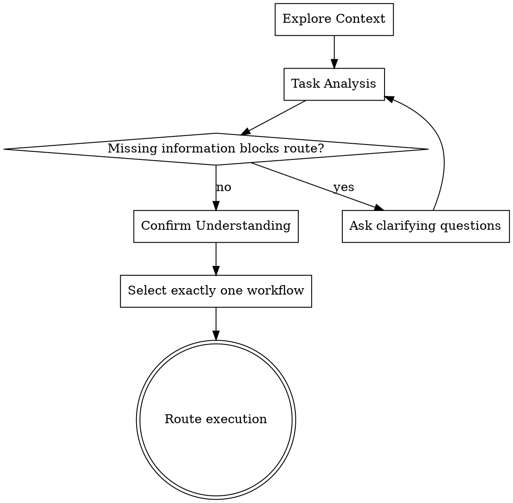

# Workflow Router

Analyze the request, confirm what needs to happen, choose the right workflow, and route execution.

`skill-router` replaces the old brainstorming-centric process. It is the orchestration layer for the skill system. It does not implement workflow logic itself; it decides which workflow should handle the task.

<HARD-GATE>
Do NOT invoke a workflow skill, write code, perform a review, debug a failure, or provide the final answer until task analysis is complete and a workflow has been selected.
</HARD-GATE>

Anti-Pattern: Assuming The Solution Before Understanding The Task

Do not skip context exploration or understanding simply because the task appears simple.

Simple tasks often hide assumptions that can lead to incorrect execution.

The amount of analysis should match the complexity of the task:

- Trivial tasks may proceed directly.
- Moderate tasks may require clarification.
- Complex or high-risk tasks should go through a design-oriented workflow.

Always ensure the request is understood before execution.

## Overview

The router follows this sequence:

1. Explore Context
2. Task Analysis
3. Clarify Questions, if needed
4. Confirm Understanding
5. Workflow Selection
6. Execute Workflow

The router must explicitly distinguish:

- **Task Type** - what category of work this is
- **Intent** - what outcome the user wants
- **Complexity** - how much structure the task needs
- **Risk** - what could go wrong if handled casually
- **Missing Information** - what is unknown and whether it blocks routing

Workflow selection is based on intent, task type, complexity, and risk together. Complexity alone is never enough.

## Responsibilities

`skill-router` is responsible for:

- Exploring enough context to understand the request
- Performing task analysis before acting
- Asking clarifying questions only when missing information blocks routing or execution
- Confirming understanding before selecting the workflow
- Selecting exactly one workflow
- Routing execution to the selected workflow
- Keeping workflow-specific reasoning out of the router

`skill-router` is not responsible for:

- Implementing feature logic
- Debugging root causes
- Performing code review findings
- Designing refactors in detail
- Writing final explanatory content before selecting Direct Answer

## Checklist

Complete these in order:

1. **Explore Context** - inspect the request, project instructions, relevant files, errors, diffs, or prior context needed to classify the task.
2. **Task Analysis** - state Task Type, Intent, Complexity, Risk, and Missing Information.
3. **Clarify Questions** - ask concise questions only if missing information blocks a correct route or would make execution risky.
4. **Confirm Understanding** - summarize the intended outcome and constraints.
5. **Select Workflow** - choose one workflow and briefly explain why.
6. **Route Execution** - invoke or follow the selected workflow skill. If the workflow is not implemented yet, stop at the placeholder boundary and explain that the workflow is a future placeholder.

## Process Flow



## The Process

**Explore Context:**

- Check the user's request, repository instructions, available files, diffs, errors, logs, or prior context before deciding the route.
- Use only enough exploration to classify the task and understand the user's goal; do not turn routing into implementation.
- If the request spans multiple unrelated goals, flag that early and route the primary task or ask the user which task to handle first.

**Task Analysis:**

Task analysis must be explicit enough that the selected route is defensible.

Use this structure:

```markdown
Task Type: [explanation | implementation | bug fix | review | refactor | mixed]
Intent: [what outcome the user wants]
Complexity: [low | medium | high] - [why]
Risk: [low | medium | high] - [what could go wrong]
Missing Information: [none | list of blockers or non-blocking unknowns]
```

### Task Type

Identify the work category from the user's request and context. Mixed requests are allowed during analysis, but workflow selection must choose one primary workflow.

### Intent

Intent is the user's desired outcome. It may differ from the literal words in the request.

Examples:

- "What does this code do?" -> understand behavior
- "Can you check this diff?" -> find production risks
- "Make this simpler" -> reduce complexity while preserving behavior
- "This test is failing" -> identify and fix the cause

### Complexity

Complexity is about coordination cost:

- **Low** - small, local, clear input and output
- **Medium** - several files, some unknowns, or moderate design choices
- **High** - cross-cutting behavior, ambiguous requirements, migration, compatibility, or broad architecture impact

### Risk

Risk is about consequence:

- **Low** - little chance of user-visible breakage
- **Medium** - behavior, data, or API contracts could be affected
- **High** - security, data loss, money movement, migrations, auth, irreversible operations, or broad production impact

### Missing Information

Separate missing information into:

- **Blocking** - cannot route or execute correctly without it
- **Non-blocking** - can proceed with a stated assumption

Ask only for blocking information. Do not use clarification as a substitute for inspecting available context.

**Confirm Understanding:**

Before routing, say back what the user wants, the important constraints, and any assumptions. Keep this to 2-3 short sentences. Confirm the task outcome, not the implementation approach.

## Workflow Selection

Select exactly one workflow.

Available workflows:

- **Direct Answer** - use for explaining something or answering a question.
- **Implementation Feature** - use for creating or changing product behavior.
- **Bug Fixing** - use when something is failing, incorrect, or unexpectedly behaving.
- **Review** - use for reviewing code, diffs, designs, or implementation quality.
- **Refactor** - use for restructuring existing implementation while preserving behavior.

Selection must consider:

- Intent
- Task Type
- Complexity
- Risk

Do not select based on complexity alone. A low-complexity security bug is still Bug Fixing with elevated risk. A high-complexity explanation is still Direct Answer if the user only wants understanding.

## Workflow Descriptions

### Direct Answer

Use when the user wants an explanation, comparison, recommendation, or answer without asking you to modify the workspace.

Route to `skills/direct-answer/skill.md`.

### Implementation Feature

Use when the user wants new behavior, changed behavior, new files, new UI, new API behavior, or new automation.

Route to `skills/implementation/skill.md`.

### Bug Fixing

Use when the user reports an error, failing test, broken behavior, regression, unexpected output, or production issue.

Route to the future bug-fixing workflow when implemented. Until then, stop at the placeholder boundary rather than inventing workflow logic here.

### Review

Use when the user asks for review, audit, validation, risk assessment, or "check this" without requesting immediate edits.

Route to `skills/review/skill.md`.

### Refactor

Use when the user wants restructuring, cleanup, simplification, renaming, extraction, or architecture changes while preserving behavior.

Route to the future refactor workflow when implemented. Until then, stop at the placeholder boundary rather than inventing workflow logic here.

## Clarifying Questions

Ask a clarifying question only when:

- The selected workflow would change based on the answer
- Execution would be unsafe without the answer
- The requested scope is contradictory
- Required inputs are unavailable from context

Do not ask when a reasonable assumption is safe and easy to state.

Ask concise questions. Prefer one question at a time when possible.

## Examples

**Request:** "Explain how authentication is wired."

Task Type: explanation  
Intent: understand current behavior  
Complexity: medium  
Risk: low  
Workflow: Direct Answer, because the user wants understanding rather than changes.

**Request:** "Add CSV export to reports."

Task Type: implementation  
Intent: add user-facing behavior  
Complexity: medium  
Risk: medium  
Workflow: Implementation Feature, because behavior changes are requested.

**Request:** "This endpoint returns 500 after the last change."

Task Type: bug fix  
Intent: restore correct behavior  
Complexity: unknown until context is explored  
Risk: medium or high depending on endpoint  
Workflow: Bug Fixing, because the request is about broken behavior.

**Request:** "Review this mapper diff."

Task Type: review  
Intent: identify production risks  
Complexity: low to medium  
Risk: medium  
Workflow: Review, because the user asks for assessment rather than edits.

**Request:** "Rename this workflow and clean up the docs without changing behavior."

Task Type: refactor  
Intent: restructure existing skill architecture  
Complexity: medium  
Risk: medium  
Workflow: Refactor, because the desired outcome is structural change while preserving and preparing behavior.

## Behavioral Guidance

- Route first, then execute.
- Keep analysis concise but explicit.
- Treat user constraints as routing inputs.
- Prefer available project context over assumptions.
- Do not invent workflow behavior for placeholder workflows.
- If a selected workflow is only a placeholder, say that clearly and stop before implementation-specific reasoning.
- If the user explicitly asks for no modifications, select Direct Answer, Review, or Research as appropriate and do not edit files.
